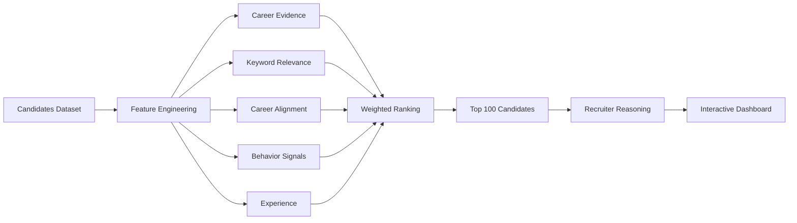
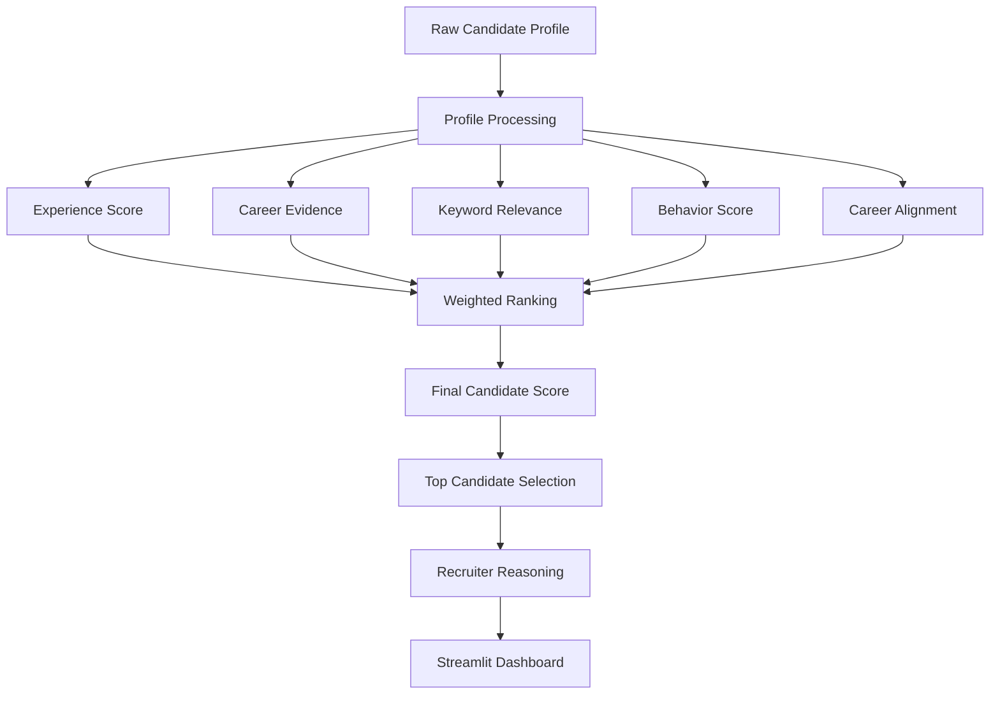
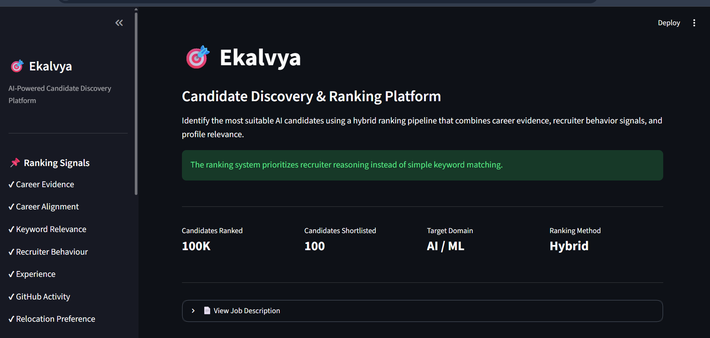
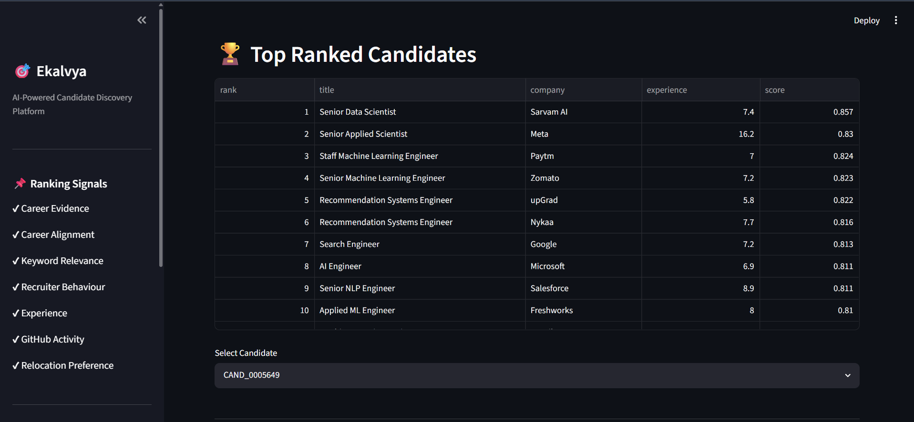
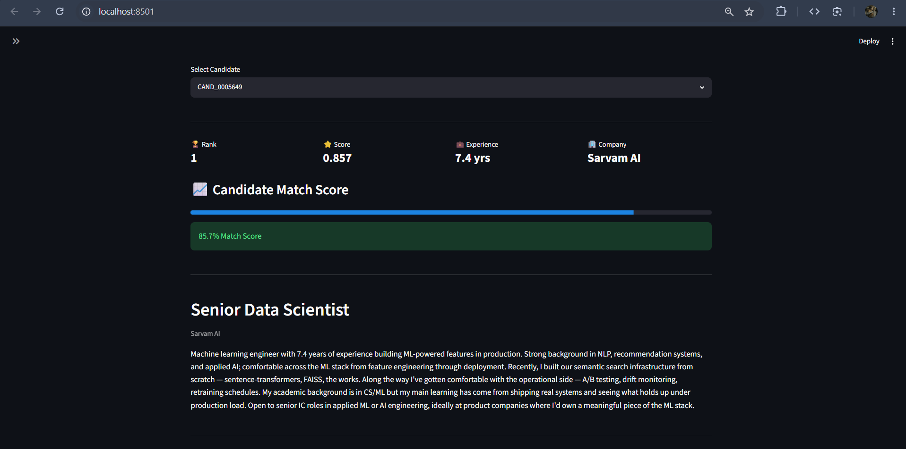

<div align="center">

# 🎯 Ekalvya

### AI-Powered Candidate Discovery & Ranking Platform

**Built for the Redrob Intelligent Candidate Discovery & Ranking Challenge**

*Finding the right candidate through recruiter-inspired reasoning rather than simple keyword matching.*


</div>

---

# 📖 Overview

Recruiters rarely hire candidates solely because their profile contains the right keywords.

A candidate with extensive production experience in recommendation systems may never explicitly mention technologies such as FAISS or Pinecone, while another candidate may list every AI buzzword despite having no relevant professional experience.

**Ekalvya** addresses this problem by combining multiple recruiter-inspired signals instead of relying on keyword matching alone.

The ranking system considers:

- ✅ Career Evidence
- ✅ Technical Relevance
- ✅ Career Alignment
- ✅ Recruiter Behavioral Signals
- ✅ Professional Experience
- ✅ GitHub Activity
- ✅ Relocation Preference

The result is a ranking system that prioritizes **real-world suitability** over keyword stuffing.

---

# ✨ Features

- 🔍 Intelligent candidate ranking
- 📊 Career evidence extraction
- 🎯 Career alignment scoring
- 📈 Recruiter behavior analysis
- 💼 Experience-based scoring
- ⭐ Explainable recruiter reasoning
- 🌐 Interactive Streamlit dashboard
- 📁 Top-100 candidate export

---

# 🏗️ System Architecture



---

# ⚙️ Ranking Pipeline



---

# 🧠 Methodology

Unlike traditional keyword-based search systems, Ekalvya combines multiple handcrafted signals that imitate recruiter reasoning.

### 1. Career Evidence

The candidate's work history is inspected for evidence of production experience.

Examples include:

- Retrieval Systems
- Recommendation Systems
- Search Infrastructure
- Embeddings
- Ranking Models
- Production Deployments

---

### 2. Keyword Relevance

Technical keywords from the Job Description are matched against:

- Profile Summary
- Professional Headline
- Career History
- Skills

Keywords are weighted according to their importance instead of assigning equal value.

---

### 3. Career Alignment

Candidates currently working in AI-related roles receive higher scores.

Examples include:

- AI Engineer
- Machine Learning Engineer
- Recommendation Systems Engineer
- Search Engineer
- Data Scientist

Profiles from unrelated domains (Sales, HR, Marketing, Accounting, etc.) are penalized.

---

### 4. Behavioral Signals

Recruitability is estimated using:

- Open To Work Status
- Recruiter Response Rate
- Notice Period

This helps prioritize candidates who are realistically available for hiring.

---

### 5. Final Weighted Ranking

The overall candidate score is computed using a weighted combination of all handcrafted features.

```
Final Score

= 0.25 × Career Evidence
+ 0.20 × Keyword Relevance
+ 0.20 × Career Alignment
+ 0.15 × Behavioral Signals
+ 0.10 × Experience
+ 0.05 × GitHub Activity
+ 0.05 × Relocation Preference
```

---

# 📂 Project Structure

```
ekalvya/

│
├── data/
│   ├── candidates.jsonl
│   ├── job_description.txt
│
├── notebooks/
│   ├── 01_data_exploration.ipynb
│   ├── 02_feature_engineering.ipynb
│   ├── 03_semantic_matching.ipynb
│
├── outputs/
│   ├── ekalvya.csv
│
├── src/
│   ├── ranking.py
│
├── app.py
├── requirements.txt
└── README.md
```

---

# 📊 Feature Summary

| Feature | Purpose |
|----------|---------|
| Career Evidence | Detect production-level AI work |
| Keyword Relevance | Measure technical similarity |
| Career Alignment | Filter unrelated professions |
| Behavioral Signals | Improve recruitability |
| Experience | Reward industry experience |
| GitHub Activity | Encourage active developers |
| Relocation | Minor ranking bonus |

---

# 🖥️ Dashboard

The project includes an interactive Streamlit dashboard that allows recruiters to explore the ranked candidates, inspect candidate profiles, and understand the reasoning behind each recommendation.

---

## Home Dashboard

<p align="center">

</p>

---

## Top Ranked Candidates

The leaderboard displays the highest-ranked candidates along with their experience, company, and overall ranking score.

<p align="center">

</p>

---

## Candidate Profile

Each shortlisted candidate includes:

- Professional Summary
- Recruiter Reasoning
- Career History
- Skills
- Match Score

<p align="center">

</p>

---

# Getting Started

## Clone the Repository

```bash
git clone https://github.com/Keertana-N/Ekalvya.git

cd ekalvya
```

---

## Install Dependencies

```bash
pip install -r requirements.txt
```

---

## Generate Candidate Rankings

```bash
python src/ranking.py
```

This generates:

```
outputs/
    ekalvya.csv
```

---

## Launch the Dashboard

```bash
streamlit run app.py
```

The Streamlit application provides:

- Dashboard
- Candidate Ranking
- Recruiter Reasoning
- Candidate Profiles
- Career History
- Skills Overview

---

# 📈 Results

Using recruiter-inspired handcrafted features instead of simple keyword matching:

- ✅ Processed **100,000 candidate profiles**
- ✅ Generated **Top 100 ranked candidates**
- ✅ Reduced keyword-stuffed false positives
- ✅ Improved explainability through recruiter reasoning
- ✅ Interactive dashboard for candidate exploration

---

# 💡 Key Insights

During exploration of the dataset, several observations emerged:

- Candidates frequently mention AI keywords without relevant professional experience.
- Career history provides stronger evidence than profile summaries alone.
- Recruitability is influenced by behavioral signals such as response rate and notice period.
- Career alignment significantly reduces false-positive rankings.
- Explainable recommendations improve trust in the ranking system.

These insights formed the foundation of the final ranking pipeline.

---

# 🛠️ Tech Stack

| Category | Technologies |
|-----------|--------------|
| Programming | Python |
| Data Processing | Pandas, NumPy |
| Machine Learning | Sentence Transformers, Scikit-Learn |
| Visualization | Matplotlib |
| Dashboard | Streamlit |
| Version Control | Git & GitHub |

---

# 📌 Future Improvements

Potential enhancements include:

- Semantic reranking using transformer embeddings
- Resume PDF parsing
- Natural language candidate search
- LLM-generated recruiter summaries
- Resume similarity search
- Real-time recruiter dashboard
- Candidate recommendation API

---

# Acknowledgements

This project was developed as part of the

## **Redrob Intelligent Candidate Discovery & Ranking Challenge**

Special thanks to the organizers for providing the dataset and designing a challenge that encouraged reasoning beyond traditional keyword-based candidate search.

---

<div align="center">

## ⭐ If you found this project interesting, consider giving it a star!

</div>
