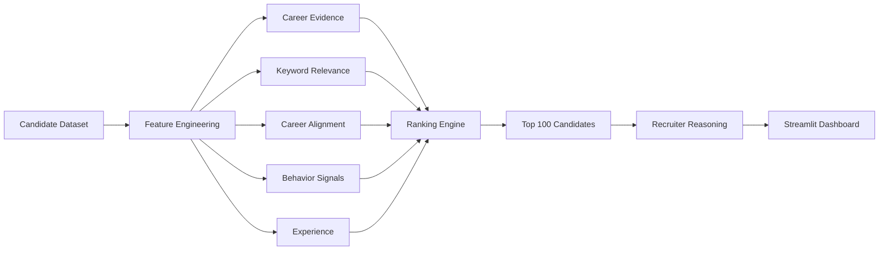

<div align="center">

# 🎯 Ekalvya

### AI-Powered Candidate Discovery & Ranking Platform

**Built for the Redrob Intelligent Candidate Discovery & Ranking Challenge**

*Finding the right candidate through recruiter-inspired reasoning rather than simple keyword matching.*


</div>

---

# 📖 Overview

Traditional Applicant Tracking Systems (ATS) rely heavily on keyword matching, often overlooking genuinely qualified candidates.

**Ekalvya** is a recruiter-inspired candidate ranking platform that evaluates candidates using multiple signals such as career evidence, career alignment, behavioral signals, technical relevance, and professional experience to identify the most suitable candidates.

---

# ✨ Features

- Intelligent candidate ranking
- Career evidence analysis
- Career alignment scoring
- Recruiter behavior signals
- Explainable recruiter reasoning
- Interactive Streamlit dashboard
- Top-100 candidate generation

---

# 🏗️ System Architecture



---

# 🖥 Dashboard

### Home

<p align="center">

</p>

### Candidate Ranking

<p align="center">

</p>

### Candidate Profile

<p align="center">

</p>

---

## Project Structure

```text
ekalvya/

├── data/
├── notebooks/
├── outputs/
├── src/
├── app.py
├── requirements.txt
└── README.md
```

---

## 🛠 Tech Stack

- Python
- Pandas
- NumPy
- Scikit-Learn
- Sentence Transformers
- Streamlit
- Matplotlib
- Git & GitHub

---

## Getting Started

```bash
git clone https://github.com/Keertana-N/Ekalvya.git

cd Ekalvya

pip install -r requirements.txt

python src/ranking.py

streamlit run app.py
```

---

## 📈 Results

- Processed **100,000 candidate profiles**
- Generated **Top 100 ranked candidates**
- Reduced keyword-stuffed false positives
- Explainable recruiter reasoning
- Interactive recruiter dashboard

---

## 🔮 Future Work

- Semantic reranking
- Resume PDF parsing
- Vector database integration
- Resume upload
- LLM-powered recruiter summaries

---

<div align="center">

⭐ Built for the **Redrob Intelligent Candidate Discovery & Ranking Challenge**

</div>